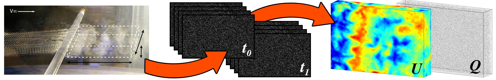
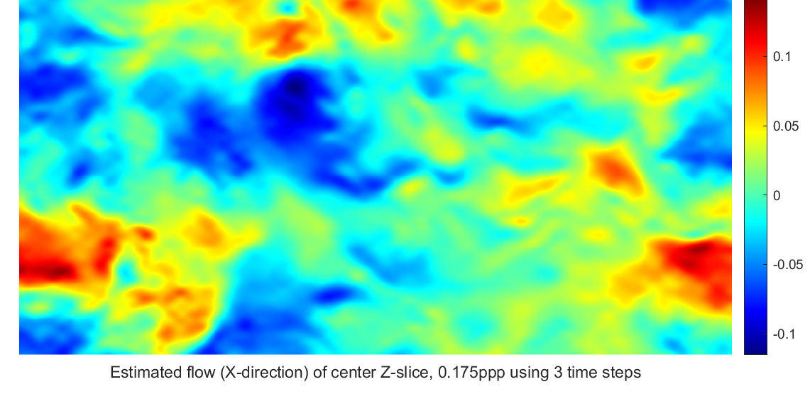
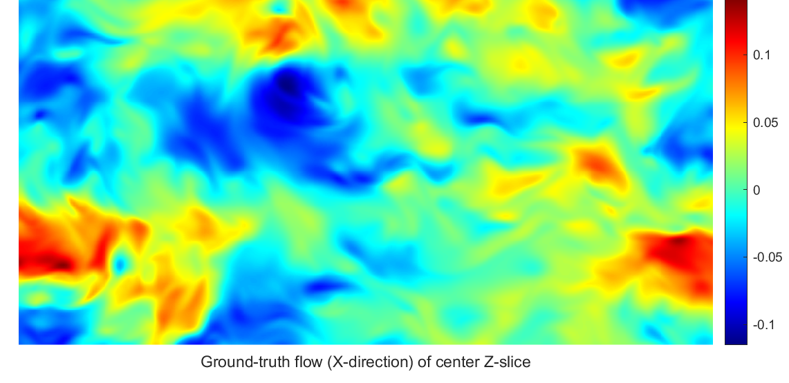

# 3D Fluid Flow Estimation with Integrated Particle Reconstruction



This repository contains code for 3D fluid motion estimation from multi-view particle images for 3D PIV/PTV measurements. For details of the approach, please see the accompanying publication [3D Fluid Flow Estimation with Integrated Particle Reconstruction](https://arxiv.org/abs/1804.03037).

If you use this project for your research, please cite:

```
@article{lasinger2020,
  author    = {Katrin Lasinger and Christoph Vogel and Thomas Pock and Konrad Schindler},
  title     = {3D Fluid Flow Estimation with Integrated Particle Reconstruction},
  journal   = {Int. J. Comput. Vis.},
  volume    = {128},
  number    = {4},
  pages     = {1012--1027},
  year      = {2020},
  url       = {https://doi.org/10.1007/s11263-019-01261-6},
  doi       = {10.1007/s11263-019-01261-6},
}
```

For the multi-time-step extension, please also cite the [paper](https://ethz.ch/content/dam/ethz/special-interest/baug/igp/photogrammetry-remote-sensing-dam/documents/pdf/Papers/ISPIV2019_Lasinger.pdf):

```
@inproceedings{,
    author = {Katrin Lasinger and Christoph Vogel and Thomas Pock and Konrad Schindler},
    title = {A Joint Energy Formulation forD Particle Reconstruction and Velocity Field Estimation},
    booktitle = {Proceedings of the 13th International Symposium on Particle Image Velocimetry},
    year = {2019},    
}
```

## Installation

* The code is written in Matlab with some parts as C++ Mex Code. Some of the Mex Code requires [Eigen](http://eigen.tuxfamily.org/) (tested with Eigen 3.3.4)
* The code was successfully tested on Linux with Matlab R2019a & GCC 6.3.0 and on Windows with Matlab R2019b & Microsoft Visual C++ 2015
* Install Eigen and run src/callMex.m to compile Mex files for your Linux or Windows platform (modify path to Eigen and windows flag inside the file dependening on your platform)  

## Getting Started

* The script ```sceneFlow_imageInput.m``` can be used to run the main algorithm in ```sceneParticleFlow.m```
* Input parameters can be adjusted in ```configImageData.m``` or by adding input arguments to the function call
* The default parameters can be used to run the code on the sample data (0.175ppp, 2 time steps)
* To run the three-timesteps-variant and use a polynomial camera model, call:  
```sceneFlow_imageInput('timesteps',[0,1,2],'isPolynomialCamModel',1);```
* For better border handling one can extend the measurement area in x and y direction:
```sceneFlow_imageInput('width_mm',64,'box_offset_x',32,'height_mm',32,'box_offset_y',16);```
* To test the algorithm on a different dataset, e.g. with lower seeding density, adapt the image input path:
```sceneFlow_imageInput('imgPath','../data/ppp0125/');```

## Example Output

Comparison of the estimated flow in X direction at center Z-slice using three time steps (top) with the ground truth (bottom) for 0.175ppp.
The flow was estimated for an extended measurement area and later cropped to the ground truth area for visualization.

Command: ```sceneFlow_imageInput('timesteps',[0,1,2],'width_mm',64,'box_offset_x',32,'height_mm',32,'box_offset_y',16);``` 

 

## License

```
MIT License

Copyright (c) 2020 ETH Zurich

Permission is hereby granted, free of charge, to any person obtaining a copy
of this software and associated documentation files (the "Software"), to deal
in the Software without restriction, including without limitation the rights
to use, copy, modify, merge, publish, distribute, sublicense, and/or sell
copies of the Software, and to permit persons to whom the Software is
furnished to do so, subject to the following conditions:

The above copyright notice and this permission notice shall be included in all
copies or substantial portions of the Software.

THE SOFTWARE IS PROVIDED "AS IS", WITHOUT WARRANTY OF ANY KIND, EXPRESS OR
IMPLIED, INCLUDING BUT NOT LIMITED TO THE WARRANTIES OF MERCHANTABILITY,
FITNESS FOR A PARTICULAR PURPOSE AND NONINFRINGEMENT. IN NO EVENT SHALL THE
AUTHORS OR COPYRIGHT HOLDERS BE LIABLE FOR ANY CLAIM, DAMAGES OR OTHER
LIABILITY, WHETHER IN AN ACTION OF CONTRACT, TORT OR OTHERWISE, ARISING FROM,
OUT OF OR IN CONNECTION WITH THE SOFTWARE OR THE USE OR OTHER DEALINGS IN THE
SOFTWARE.

Author: Katrin Lasinger
```
